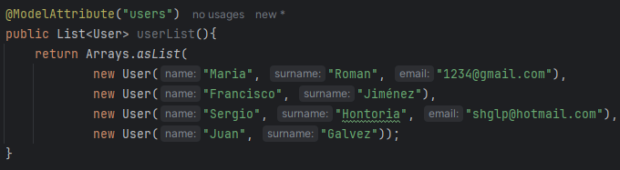
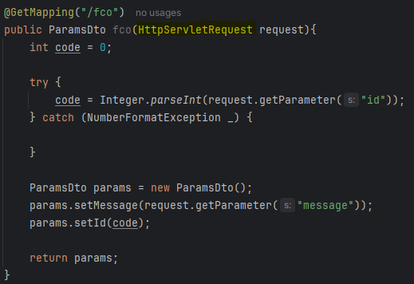

## Preguntas

¿Como cambiar el puerto 8080 que viene por defecto por otro?
 Acedemos al directorio `resources`, y nos metemos en application.properties. Una vez dentro, escribimos `server.port=8090` por ejemplo (siempre y cuando este vacio ese puerto).

¿Que es DTO  (Data Transfer Object), o Objeto de Transferencia de Datos?
es una herramienta útil para trasladar datos entre las capas de una aplicación de forma eficiente y controlada, asegurando que solo la información relevante y segura se transfiera.

## Tipos de modulos dentro de Spring

- Spring MVC -> es el módulo dentro de Spring que permite construir aplicaciones web siguiendo el patrón MVC, facilitando el manejo de solicitudes HTTP, el procesamiento de lógica de negocio y la renderización de vistas, manteniendo una clara separación de responsabilidades entre los diferentes componentes de la aplicación.
  

## Anotaciones - Etiquetas @ de SpringBoot

- @Controller -> en una clase Java le indica a Spring que esa clase manejará solicitudes HTTP y enviará respuestas, actuando como un controlador en el patrón MVC.  

- @RestController -> le indica a Spring que la clase manejará solicitudes HTTP y enviará respuestas, pero a diferencia de @Controller, se especializa en servicios REST. Combina las anotaciones @Controller y @ResponseBody, lo que significa que los métodos devolverán directamente datos (como JSON o XML) en lugar de vistas o páginas HTML.  
 

- @GetMapping -> simplifica la forma de manejar solicitudes GET en aplicaciones Spring.  

- @RequestMapping -> puedes usar `@RequestMapping` para mapear solicitudes HTTP a métodos específicos en un controlador, lo que proporciona flexibilidad para manejar diferentes tipos de solicitudes y rutas en tu aplicación.  
 

-  @ModelAttribute -> se utiliza para trabajar con datos en los controladores de Spring MVC. Su propósito principal es simplificar la interacción con los datos que se envían y reciben en las solicitudes web
   

- @RequestParam -> captura las variables de la URL y las hace accesibles dentro del código del controlador.
  

    Si queremos vararias variables:

    

    Y para pasar variables rapidamente, usamos la inyención de dependencia `HttpServletRequest`. Esto lo que permite interactuar con los detalles de la solicitud HTTP que llega al servidor y obtener toda la información que envía el cliente mediante la url.
    
           

- @PathVariable -> se usa para capturar parametros de la url.

 