## Preguntas

¿Como cambiar el puerto 8080 que viene por defecto por otro?
Acedemos al directorio `resources`, y nos metemos en application.properties. Una vez dentro, escribimos `server.port=8090` por ejemplo (siempre y cuando este vacio ese puerto).

¿Que es DTO  (Data Transfer Object), o Objeto de Transferencia de Datos?
es una herramienta útil para trasladar datos entre las capas de una aplicación de forma eficiente y controlada, asegurando que solo la información relevante y segura se transfiera.

## Tipos de modulos dentro de Spring

- Spring MVC -> es el módulo dentro de Spring que permite construir aplicaciones web siguiendo el patrón MVC, facilitando el manejo de solicitudes HTTP, el procesamiento de lógica de negocio y la renderización de vistas, manteniendo una clara separación de responsabilidades entre los diferentes componentes de la aplicación.

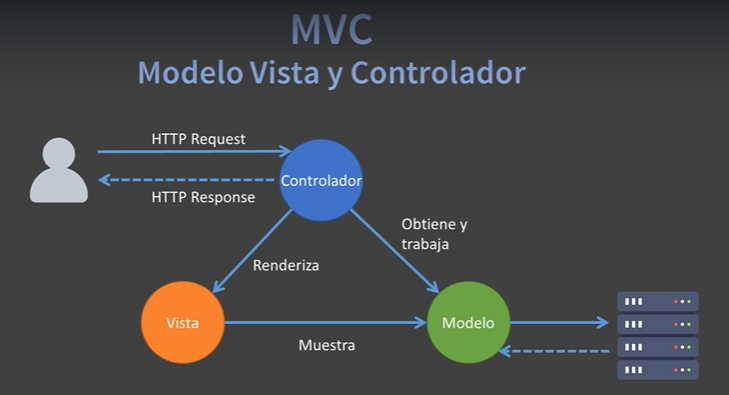

## Anotaciones - Etiquetas @ de SpringBoot

- @Controller -> en una clase Java le indica a Spring que esa clase manejará solicitudes HTTP y enviará respuestas, actuando como un controlador en el patrón MVC.

- @RestController -> le indica a Spring que la clase manejará solicitudes HTTP y enviará respuestas, pero a diferencia de @Controller, se especializa en servicios REST. Combina las anotaciones @Controller y @ResponseBody, lo que significa que los métodos devolverán directamente datos (como JSON o XML) en lugar de vistas o páginas HTML.

- @Values ->  es una herramienta útil en Spring para inyectar valores simples y configuraciones desde el exterior de la aplicación, permitiendo una fácil parametrización y adaptación de la aplicación en diferentes entornos.
 
  - Los valores se pueden poner en el fichero properties o en uno nuevo que creemos.
  
    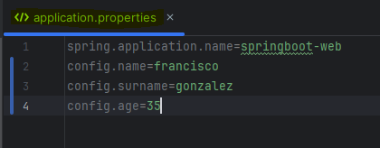
  
  - Luego añadimos las propiedades en la clase que vayamos usar los valores.
  
    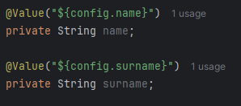
  
  - O tambien la podemos llamar desde el propio metodo pasado por parametro.
  
    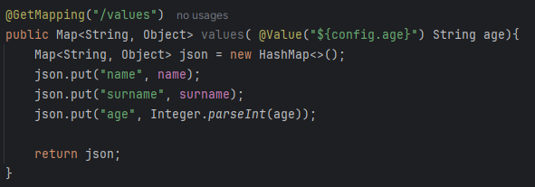
  
  - La otra forma, es creando un nuevo fichero en la raiz de la carpeta resourse y poniendo la siguiente anotación en el fichero prinpipal de arranque `SpringbootWebApplication`. O si al mismo nivel que esta dicha clase, creamos otra clase (values.java) y ponemos las anotaciones ahi.
  
    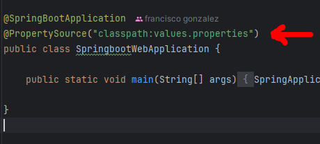
  
    Esto es si queremos poner varios ficheros.

    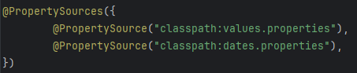

  - Tambien, podemos crear una clase al mismo nivel que `SpringbootWebApplication` llamada por ejemplo values.java y poner ahi la configuración para poder usar los ficheros propierties.

    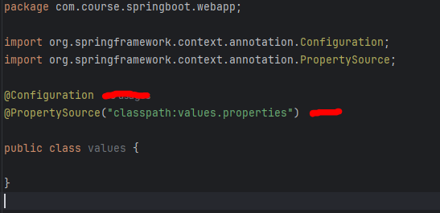
  
  - Tambien se puede trabajar con una expresión SpEL (Spring Expression Language). Esto permite realizar operaciones antes de dar valor a alguna propiedad.

    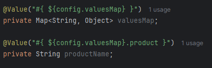

- @Autowired -> se utiliza para inyectar automáticamente dependencias en un componente. Esto significa que Spring busca y proporciona la instancia correcta de un objeto (bean) en el contexto de la aplicación para un campo, constructor, o método marcado con @Autowired, eliminando la necesidad de crear manualmente esas instancias.

  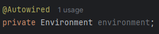

  La combinación de @Autowired y Environment inyecta automáticamente un bean de Environment en la clase, lo que permite acceder a las configuraciones y propiedades de la aplicación de manera sencilla y dinámica. Esto es útil para gestionar configuraciones centralizadas y realizar ajustes en el comportamiento de la aplicación según el entorno o perfil activo.

  
Y el uso de enviroment seria:

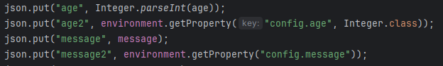

- @GetMapping -> simplifica la forma de manejar solicitudes GET en aplicaciones Spring.

- @PostMapping -> es una forma conveniente y específica de manejar solicitudes POST en aplicaciones web construidas con Spring Framework.

- @RequestMapping -> puedes usar `@RequestMapping` para mapear solicitudes HTTP a métodos específicos en un controlador, lo que proporciona flexibilidad para manejar diferentes tipos de solicitudes y rutas en tu aplicación.

-  @ModelAttribute -> se utiliza para trabajar con datos en los controladores de Spring MVC. Su propósito principal es simplificar la interacción con los datos que se envían y reciben en las solicitudes web
   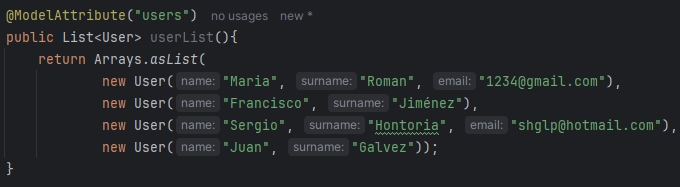

- @RequestParam -> captura las variables de la URL y las hace accesibles dentro del código del controlador.
  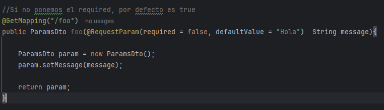

  Si queremos vararias variables:

  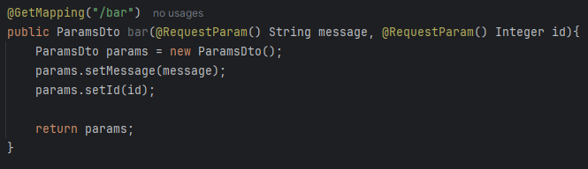

  Y para pasar variables rapidamente, usamos la inyención de dependencia `HttpServletRequest`. Esto lo que permite interactuar con los detalles de la solicitud HTTP que llega al servidor y obtener toda la información que envía el cliente mediante la url.

  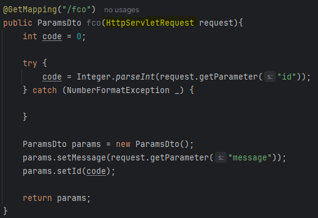

- @PathVariable -> se usa para capturar parametros de la url.

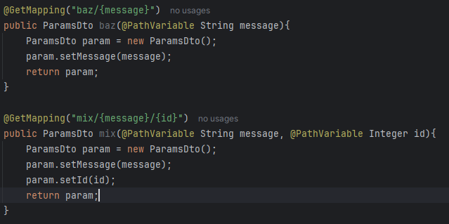 
